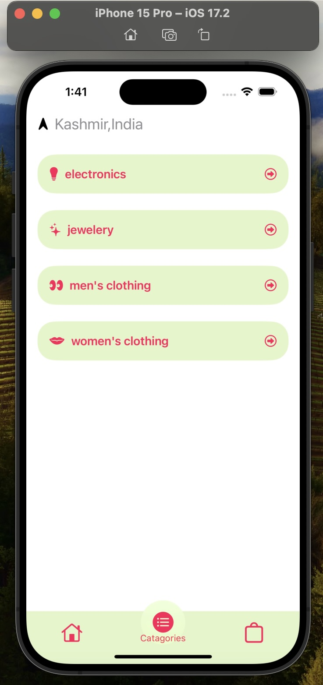
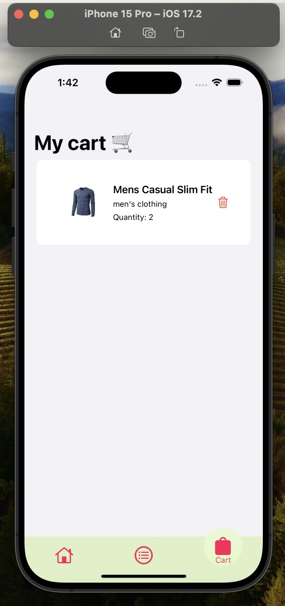

#E-Commerce App

## Overview

An e-commerce iOS application developed using SwiftUI and integrated with the FakeStoreAPI to provide a seamless shopping experience for users. The app allows users to browse through various categories of products, view product details, add items to their cart, and proceed to checkout.

## Features

- **Product Listing**: Display a list of products categorized by type.
- **Product Details**: View detailed information about each product, including its name, price, description, and image.
- **Shopping Cart**: Add products to the cart for future purchase.
- **Checkout Process**: Proceed to checkout and finalize the purchase.

## Technologies Used

- **SwiftUI**: Used for building the user interface of the application.
- **FakeStoreAPI**: Integrated to fetch product data for the app.
- **SwiftData**: A custom data handling solution used to manage product data within the app.

## Acknowledgements

- FakeStoreAPI for providing the product data used in the app.
- SwiftUI and Apple's development tools for making the development process smoother.
- Contributors who have helped improve and maintain the SwiftData project.
  

